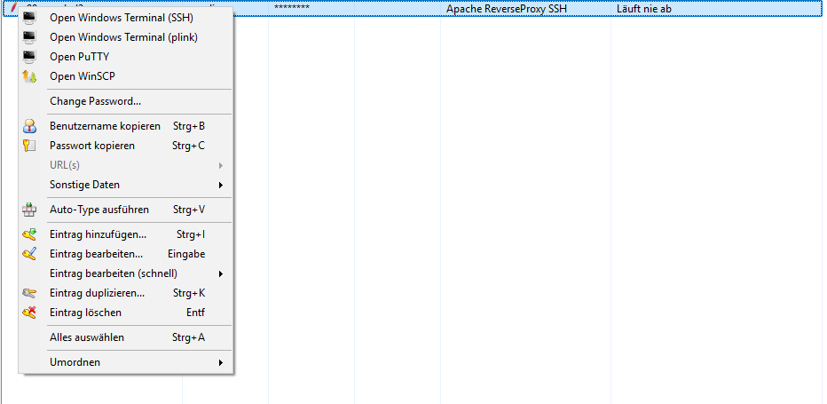
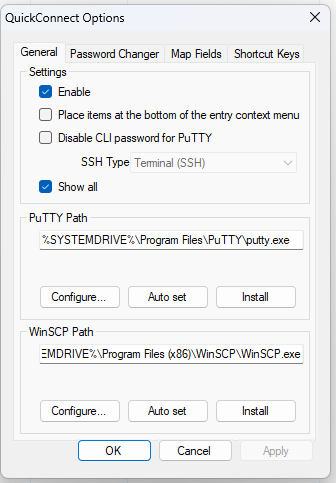
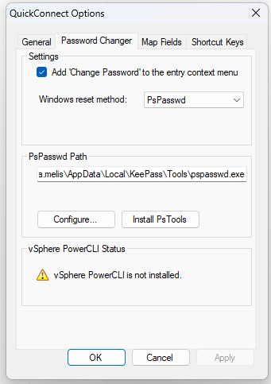
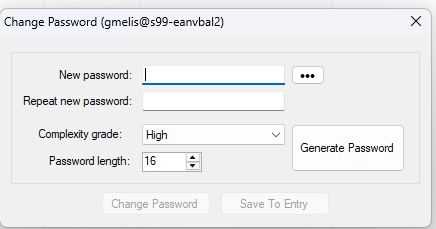
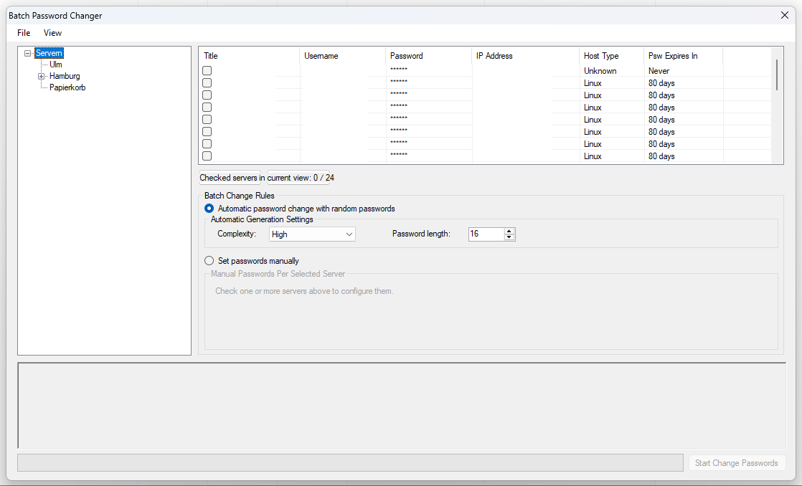

# NeoQuickConnectPlugin

NeoQuickConnectPlugin is an unofficial modified fork of [cristianst85/QuickConnectPlugin](https://github.com/cristianst85/QuickConnectPlugin) for [KeePass](https://keepass.info). It keeps the original QuickConnect idea - open remote hosts directly from KeePass entries - and extends it with Windows Terminal SSH workflows, stronger password-change tooling, and a more complete batch password changer.

This fork is based on upstream QuickConnectPlugin `0.6.1` and keeps the original GPLv2-or-later license and copyright notices.

> Note: the public fork/repository is branded as **NeoQuickConnectPlugin**. Some internal project, namespace, and output names remain `QuickConnectPlugin` for compatibility with the original KeePass plugin structure and build scripts.

## Major Changes From Upstream

- Windows Terminal SSH launch support:
  - Open with native `ssh`.
  - Open with Windows Terminal plus `plink`.
  - Keep classic PuTTY as the default/fallback.
- SSH menu customization:
  - Choose the preferred SSH client in options.
  - Show one preferred SSH action or all available SSH launchers.
- Better tool detection:
  - Auto-detect PuTTY, plink, WinSCP, Windows Terminal, and PsPasswd.
  - Store common tool paths with environment variables where possible.
- Built-in installer helpers:
  - Install or auto-set PuTTY and WinSCP paths.
  - Install/copy PsTools/PsPasswd with WinGet support.
  - Includes `scripts/Ensure-WinGet.ps1` to help enable or repair WinGet/App Installer.
- Expanded Windows password reset support:
  - PsPasswd method with preflight checks for RPC/SMB reachability and required Windows services.
  - SSH method using Windows OpenSSH Server and SSH.NET.
- Reworked batch password changer:
  - Automatic per-host generated passwords.
  - Manual per-host passwords.
  - Selection summary, richer status log, start/success/failure messages, and backend operation details.
- Password generation:
  - Cryptographic random password generator.
  - Low, medium, and high complexity profiles.
- Runtime/project update:
  - Main plugin project targets .NET Framework 4.8.

See [FORK_NOTES.md](FORK_NOTES.md) for a fuller source-level comparison against the original project.

## Screenshots

### Context Menu

### General Options

### Password Changer Options

### Quick Password Change

### Batch Password Changer

## Requirements

- Microsoft Windows with .NET Framework 4.8.
- KeePass 2.52 or newer.
- Optional tools depending on features used:
  - PuTTY/plink for classic SSH or Windows Terminal plink mode.
  - WinSCP for file transfer actions.
  - PsPasswd/PsTools for the PsPasswd Windows password reset method.
  - Windows OpenSSH Server on target machines for the SSH Windows password reset method.
  - vSphere PowerCLI for ESXi password-changing support.

## Installation

Download `QuickConnectPlugin.plgx` from the latest NeoQuickConnectPlugin release and copy it into your KeePass plugins directory.

The `.plgx` file keeps the original plugin output name for KeePass compatibility. Use the release artifacts from this fork rather than the original upstream releases.

## Usage

- The plugin adds a **NeoQuickConnect** menu under KeePass **Tools**.
- Map KeePass fields in the options dialog so the plugin can read:
  - host address,
  - connection method,
  - additional connection options.
- Connection method text determines which actions are shown for an entry:
  - `rdp` or `windows`: Remote Desktop actions.
  - `esxi` or `vcenter`: vSphere Client action.
  - `ssh`, `telnet`, `linux`, or known Linux distribution names: PuTTY, Windows Terminal SSH/plink, and WinSCP actions depending on settings.
- Additional options can define session, port, key file, command, and WinSCP protocol values.

## Password Changer

NeoQuickConnectPlugin can change passwords for Windows, Linux, and ESXi hosts from KeePass. The modified fork adds per-host batch passwords, automatic generation, Windows password reset over SSH, and clearer result logging.

For Windows hosts, choose one of:

- `PsPasswd`: uses Sysinternals PsPasswd and checks RPC/SMB prerequisites before trying the change.
- `SSH`: connects to Windows OpenSSH Server and runs the password change remotely.

## Security Considerations

- PuTTY/plink, WinSCP, PsPasswd, and some legacy launch paths can expose passwords through command-line arguments while the child process is running.
- Native Windows Terminal SSH launch does not pass the KeePass password on the command line.
- Batch password changes update KeePass entries after successful remote changes. Keep backups of important databases before large batch operations.

## Relationship To Upstream

This is not an official QuickConnectPlugin release. It is a modified fork intended to keep the original project useful for newer Windows/KeePass workflows while clearly crediting the upstream author.

Original upstream project: [cristianst85/QuickConnectPlugin](https://github.com/cristianst85/QuickConnectPlugin)

## License

- The source code remains under GNU GPLv2 or later. See [LICENSE](LICENSE) and [COPYING](COPYING).
- Original QuickConnectPlugin copyright and notices are preserved.
- Menu item icons are from Crystal Clear icon set by Everaldo Coelho, licensed under LGPL v2.1 or later.
- Includes SSH.NET, copyrighted by RENCI and released under the MIT License.
- Includes code from KeePass, licensed under GNU GPLv2 or later.
